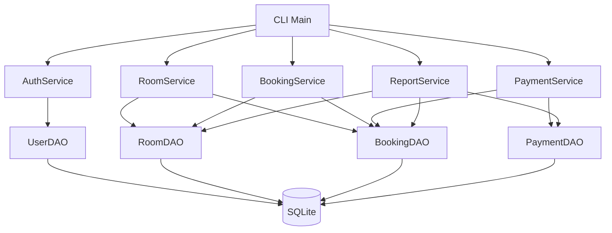
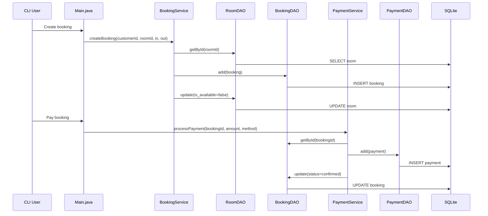
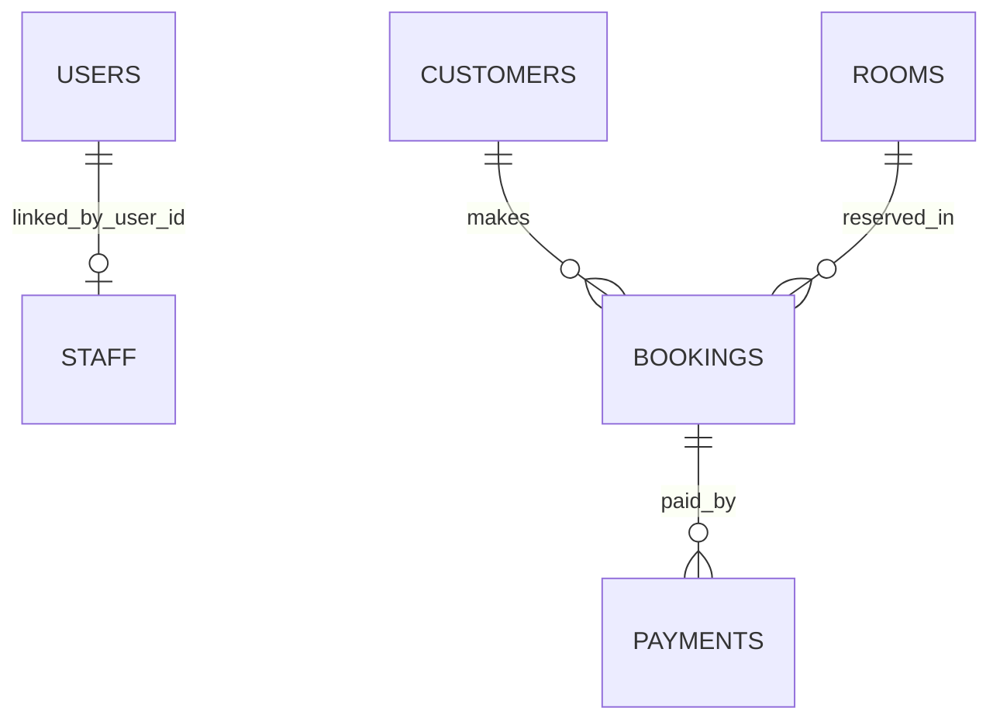
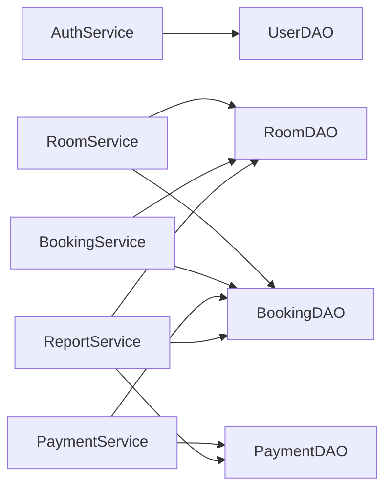

# Project Overview

This document explains the current Hotel Management System codebase for new developers.
It is intended as an internal handover guide for teammates.

## Architecture

The project follows a layered architecture:

1. Presentation layer: CLI entry point in Main.java (GUI folders exist but are mostly placeholders)
2. Service layer: business logic and workflow orchestration
3. DAO layer: database access and SQL execution
4. Model layer: POJOs used for data transfer
5. Database layer: SQLite schema in database/schema.sql

### High-Level Flow

- Main.java receives user input and routes to services.
- Services validate input and business rules, then call DAOs.
- DAOs run SQL queries and map ResultSet to model objects.
- Utilities support cross-cutting concerns (date logic, password hashing, file export).

## Folder Structure

- src/hotel/config: DB connection and schema bootstrap
- src/hotel/model: entity models (User, Room, Customer, Staff, Booking, Payment)
- src/hotel/dao: CRUD and query adapters per table
- src/hotel/service: business workflows
- src/hotel/main: CLI app and role-based menus
- src/hotel/util: helpers (date, password hash, export)
- src/hotel/ui: GUI scaffolding (currently mostly empty)
- src/hotel/test: DB/DAO/integration test drivers
- database/schema.sql: SQLite schema

## Component Connections

## Database Relations

Table summary:

- users: authentication and role data
- staff: employee profile linked to users.id
- customers: customer profile
- rooms: inventory and availability
- bookings: customer-room reservation records
- payments: payment/refund records for bookings

# Module: Configuration

## File: src/hotel/config/DBConnection.java

### Class: DBConnection

#### DBConnection() [private]
- Purpose: Prevent instantiation of utility-style static connection holder.
- Parameters: none
- Returns: constructor
- Side effects: none

#### getConnection()
- Purpose: Return active JDBC connection to SQLite; create it lazily if missing/closed.
- Parameters: none
- Returns: Connection
- Workflow:
1. Check static connection reference.
2. If null/closed, load SQLite JDBC driver and create connection.
3. Return singleton connection.
- Dependencies: java.sql.DriverManager, org.sqlite.JDBC
- Side effects: Opens DB connection.
- Used by: All DAO classes, DBInitializer

#### closeConnection()
- Purpose: Close the shared DB connection safely.
- Parameters: none
- Returns: void
- Workflow:
1. If connection exists and is open, close it.
2. Set static reference to null.
- Dependencies: java.sql.Connection
- Side effects: Closes active connection.
- Used by: tests, application shutdown paths

## File: src/hotel/config/DBInitializer.java

### Class: DBInitializer

#### initialize()
- Purpose: Initialize database tables from schema.sql.
- Parameters: none
- Returns: void
- Workflow:
1. Read database/schema.sql content.
2. Split SQL by semicolon.
3. For each statement, detect CREATE TABLE and skip if already exists.
4. Execute remaining statements.
- Dependencies: DBConnection, Files API, Statement
- Side effects: Creates tables, prints initialization messages.
- Used by: Main.main, test setup

#### tableExists(String tableName)
- Purpose: Check sqlite_master for table presence.
- Parameters: tableName
- Returns: boolean
- Dependencies: DBConnection, PreparedStatement
- Side effects: DB read query
- Used by: initialize()

#### isCreateTable(String statement) [private]
- Purpose: Detect whether SQL statement is a CREATE TABLE statement.
- Parameters: statement
- Returns: boolean
- Dependencies: String operations
- Side effects: none
- Used by: initialize()

#### extractTableName(String createTableSql) [private]
- Purpose: Parse table name from CREATE TABLE SQL text.
- Parameters: createTableSql
- Returns: String or null
- Dependencies: regex Pattern/Matcher
- Side effects: none
- Used by: initialize()

# Module: DAO Layer

## File: src/hotel/dao/IDao.java

### Interface: IDao<T>

#### add(T obj)
- Purpose: Insert a new record.
- Parameters: obj
- Returns: void

#### getById(int id)
- Purpose: Fetch single record by primary key.
- Parameters: id
- Returns: T or null

#### getAll()
- Purpose: Fetch all records.
- Parameters: none
- Returns: List<T>

#### update(T obj)
- Purpose: Update an existing record.
- Parameters: obj
- Returns: void

#### delete(int id)
- Purpose: Delete record by id.
- Parameters: id
- Returns: void

## File: src/hotel/dao/UserDAO.java

### Class: UserDAO implements IDao<User>

#### add(User user)
- Purpose: Insert user and set generated id.
- Parameters: user
- Returns: void
- Business logic: Persists username/password/role/created_at.
- Dependencies: DBConnection, users table
- Side effects: Writes DB and mutates user.id

#### getById(int id)
- Purpose: Load user by id.
- Returns: User or null
- Dependencies: DBConnection

#### getAll()
- Purpose: List all users by id.
- Returns: List<User>

#### update(User user)
- Purpose: Update user columns by id.
- Returns: void

#### delete(int id)
- Purpose: Delete user by id.
- Returns: void

#### getByUsername(String username)
- Purpose: Lookup user for login.
- Returns: User or null
- Used by: AuthService.login, registration checks

#### mapUser(ResultSet rs) [private]
- Purpose: Convert ResultSet row to User model.
- Returns: User

## File: src/hotel/dao/RoomDAO.java

### Class: RoomDAO implements IDao<Room>

#### add(Room room)
- Purpose: Insert room and assign generated id.
- Side effects: DB write and room.id mutation

#### getById(int id)
- Purpose: Fetch room by id.

#### getAll()
- Purpose: Fetch all rooms.

#### update(Room room)
- Purpose: Update room number/type/price/availability.

#### delete(int id)
- Purpose: Delete room by id.

#### getAvailableRooms()
- Purpose: Fetch only is_available = 1 rooms.
- Used by: RoomService.getAvailableRooms

#### getRoomsByType(String type)
- Purpose: Filter rooms by type.
- Used by: RoomService.searchRooms

#### mapRoom(ResultSet rs) [private]
- Purpose: Convert DB row to Room.

## File: src/hotel/dao/CustomerDAO.java

### Class: CustomerDAO implements IDao<Customer>

#### add(Customer customer)
- Purpose: Insert customer and set id.

#### getById(int id)
- Purpose: Load customer by id.

#### getAll()
- Purpose: Load all customers.

#### update(Customer customer)
- Purpose: Update customer fields.

#### delete(int id)
- Purpose: Delete customer.

#### getByEmail(String email)
- Purpose: Lookup customer by unique email.
- Used by: registration flow

#### searchByName(String keyword)
- Purpose: Name LIKE search.
- Used by: customer menu search

#### mapCustomer(ResultSet rs) [private]
- Purpose: Convert row to Customer.

## File: src/hotel/dao/StaffDAO.java

### Class: StaffDAO implements IDao<Staff>

#### add(Staff staff)
- Purpose: Insert staff profile linked to user id.

#### getById(int id)
- Purpose: Load staff by id.

#### getAll()
- Purpose: Load all staff rows.

#### update(Staff staff)
- Purpose: Update staff fields.

#### delete(int id)
- Purpose: Delete staff.

#### getByPosition(String position)
- Purpose: Filter staff by role/position.

#### mapStaff(ResultSet rs) [private]
- Purpose: Convert row to Staff.

## File: src/hotel/dao/BookingDAO.java

### Class: BookingDAO implements IDao<Booking>

#### add(Booking booking)
- Purpose: Insert booking and set generated id.

#### getById(int id)
- Purpose: Fetch booking by id.

#### getAll()
- Purpose: List all bookings.

#### update(Booking booking)
- Purpose: Update booking fields and status.

#### delete(int id)
- Purpose: Delete booking.

#### getByCustomerId(int customerId)
- Purpose: List bookings for one customer.

#### getByStatus(String status)
- Purpose: List bookings by state (pending/confirmed/cancelled).

#### getByRoomId(int roomId)
- Purpose: List bookings for one room.

#### mapBooking(ResultSet rs) [private]
- Purpose: Convert row to Booking.

## File: src/hotel/dao/PaymentDAO.java

### Class: PaymentDAO implements IDao<Payment>

#### add(Payment payment)
- Purpose: Insert payment and set generated id.

#### getById(int id)
- Purpose: Fetch payment by id.

#### getAll()
- Purpose: List all payments.

#### update(Payment payment)
- Purpose: Update payment fields/status.

#### delete(int id)
- Purpose: Delete payment.

#### getByBookingId(int bookingId)
- Purpose: List payment records for a booking.

#### getTotalRevenue()
- Purpose: Sum paid payment amounts.
- Returns: double
- Business logic: only includes status = paid.

#### mapPayment(ResultSet rs) [private]
- Purpose: Convert row to Payment.

# Module: Model Layer

## File: src/hotel/model/User.java

### Class: User
- Purpose: Authentication account and role model.
- Fields: id, username, passwordHash, role, createdAt

Methods:
- User() and User(int, String, String, String, String): constructors
- getId / setId
- getUsername / setUsername
- getPasswordHash / setPasswordHash
- getRole / setRole
- getCreatedAt / setCreatedAt
- toString

Notes:
- Side effects only in setters (mutating object state).
- Used by AuthService, UserDAO, Main, Staff linkage.

## File: src/hotel/model/Room.java

### Class: Room
- Purpose: Room inventory model.
- Fields: id, roomNumber, type, pricePerNight, isAvailable

Methods:
- Room() and Room(int, String, String, double, boolean)
- getId / setId
- getRoomNumber / setRoomNumber
- getType / setType
- getPricePerNight / setPricePerNight
- isAvailable / setAvailable
- toString

## File: src/hotel/model/Customer.java

### Class: Customer
- Purpose: Customer profile model.
- Fields: id, name, email, phone, address

Methods:
- Customer() and Customer(int, String, String, String, String)
- getId / setId
- getName / setName
- getEmail / setEmail
- getPhone / setPhone
- getAddress / setAddress
- toString

## File: src/hotel/model/Staff.java

### Class: Staff
- Purpose: Staff profile linked to User account.
- Fields: id, name, position, salary, userId

Methods:
- Staff() and Staff(int, String, String, double, int)
- getId / setId
- getName / setName
- getPosition / setPosition
- getSalary / setSalary
- getUserId / setUserId
- toString

## File: src/hotel/model/Booking.java

### Class: Booking
- Purpose: Reservation model.
- Fields: id, customerId, roomId, checkInDate, checkOutDate, totalPrice, status

Methods:
- Booking() and Booking(int, int, int, String, String, double, String)
- getId / setId
- getCustomerId / setCustomerId
- getRoomId / setRoomId
- getCheckInDate / setCheckInDate
- getCheckOutDate / setCheckOutDate
- getTotalPrice / setTotalPrice
- getStatus / setStatus
- toString

## File: src/hotel/model/Payment.java

### Class: Payment
- Purpose: Payment transaction model.
- Fields: id, bookingId, amount, paymentDate, method, status

Methods:
- Payment() and Payment(int, int, double, String, String, String)
- getId / setId
- getBookingId / setBookingId
- getAmount / setAmount
- getPaymentDate / setPaymentDate
- getMethod / setMethod
- getStatus / setStatus
- toString

# Module: Service Layer

## File: src/hotel/service/BaseService.java

### Class: BaseService (abstract)

#### getServiceName() [abstract]
- Purpose: Force service subclasses to provide service label.
- Returns: String

#### logAction(String action)
- Purpose: Standardized service-level console logging.
- Side effects: stdout write

## File: src/hotel/service/AuthService.java

### Class: AuthService

#### AuthService()
- Purpose: Construct service with default UserDAO.

#### AuthService(UserDAO userDAO)
- Purpose: Constructor injection for testing or custom DAO.

#### login(String username, String password)
- Purpose: Authenticate user and set current session user.
- Parameters: username, password
- Returns: boolean
- Workflow:
1. Lookup user by username.
2. Verify password hash.
3. If valid, set loggedInUser and log action.
- Dependencies: UserDAO, PasswordHasher
- Side effects: updates session state
- Used by: Main.handleLogin

#### logout()
- Purpose: Clear session user.
- Side effects: loggedInUser = null

#### isLoggedIn()
- Purpose: Check session state.
- Returns: boolean

#### getCurrentUser()
- Purpose: Return current authenticated user.
- Returns: User or null

#### getServiceName()
- Purpose: BaseService override label.

## File: src/hotel/service/RoomService.java

### Class: RoomService

#### RoomService()
- Purpose: Construct with default RoomDAO and BookingDAO.

#### RoomService(RoomDAO roomDAO, BookingDAO bookingDAO)
- Purpose: Constructor injection.

#### addRoom(String number, String type, double price)
- Purpose: Validate and create room.
- Returns: boolean
- Validation: non-empty number/type, price > 0
- Side effects: inserts room row
- Used by: Main.roomMenu

#### updateRoom(Room room)
- Purpose: Validate and update room record.
- Returns: boolean
- Side effects: DB update

#### deleteRoom(int roomId)
- Purpose: Delete room only if no active bookings exist.
- Returns: boolean
- Business logic: checks booking statuses and blocks deletion when pending/confirmed exists.
- Side effects: DB delete if allowed

#### getAllRooms()
- Purpose: Return all rooms.
- Returns: List<Room>

#### getAvailableRooms()
- Purpose: Return only currently available rooms.
- Returns: List<Room>

#### searchRooms(String type)
- Purpose: Type-based room search.
- Returns: List<Room>
- Logic: if type blank -> return all

#### getServiceName()
- Purpose: BaseService override label.

## File: src/hotel/service/BookingService.java

### Class: BookingService

#### BookingService()
- Purpose: Construct with default BookingDAO and RoomDAO.

#### BookingService(BookingDAO bookingDAO, RoomDAO roomDAO)
- Purpose: Constructor injection.

#### createBooking(int customerId, int roomId, String checkIn, String checkOut)
- Purpose: Create new booking and reserve room.
- Returns: Booking or null
- Validation: date format valid, checkIn before checkOut, room exists and available
- Business logic:
1. Calculate nights using DateUtil.
2. totalPrice = room.pricePerNight * nights.
3. Insert booking with status pending.
4. Set room availability false.
- Dependencies: BookingDAO, RoomDAO, DateUtil
- Side effects: DB write to bookings and rooms
- Used by: Main.bookingMenu, integration tests

#### cancelBooking(int bookingId)
- Purpose: Cancel booking and release room.
- Returns: boolean
- Business logic: set status cancelled, set room available true
- Side effects: DB updates on bookings and rooms

#### confirmBooking(int bookingId)
- Purpose: Mark booking as confirmed.
- Returns: boolean
- Side effects: DB booking status update

#### getBookingsForCustomer(int customerId)
- Purpose: List customer bookings.
- Returns: List<Booking>

#### getAllBookings()
- Purpose: List all bookings.
- Returns: List<Booking>

#### getServiceName()
- Purpose: BaseService override label.

## File: src/hotel/service/PaymentService.java

### Class: PaymentService

#### PaymentService()
- Purpose: Construct with default PaymentDAO and BookingDAO.

#### PaymentService(PaymentDAO paymentDAO, BookingDAO bookingDAO)
- Purpose: Constructor injection.

#### processPayment(int bookingId, double amount, String method)
- Purpose: Validate booking and payment amount, record payment, confirm booking.
- Returns: Payment or null
- Validation: booking must exist; amount must match booking total
- Business logic:
1. Create payment with current date and status paid.
2. Persist payment.
3. Update booking status confirmed.
- Dependencies: PaymentDAO, BookingDAO, DateUtil
- Side effects: DB insert/update
- Used by: Main.paymentMenu

#### refundPayment(int paymentId)
- Purpose: Mark payment refunded.
- Returns: boolean
- Side effects: DB status update

#### getPaymentsForBooking(int bookingId)
- Purpose: List payments for a booking.
- Returns: List<Payment>

#### getTotalRevenue()
- Purpose: Return sum of paid payments.
- Returns: double

#### getServiceName()
- Purpose: BaseService override label.

## File: src/hotel/service/ReportService.java

### Class: ReportService

#### ReportService()
- Purpose: Construct with default DAOs.

#### ReportService(RoomDAO roomDAO, BookingDAO bookingDAO, PaymentDAO paymentDAO)
- Purpose: Constructor injection.

#### generateOccupancyReport()
- Purpose: Build occupancy summary text.
- Returns: String
- Logic: counts total, available, occupied rooms
- Dependencies: RoomDAO
- Side effects: none

#### generateRevenueReport()
- Purpose: Build revenue summary text.
- Returns: String
- Logic: sums paid amounts and counts paid transactions
- Dependencies: PaymentDAO

#### generateBookingSummary()
- Purpose: Build booking status breakdown.
- Returns: String
- Logic: counts pending/confirmed/cancelled
- Dependencies: BookingDAO

#### exportReport(String content, String filename)
- Purpose: Persist report content to reports directory.
- Returns: void
- Dependencies: ReportExporter
- Side effects: file write, folder creation

#### getServiceName()
- Purpose: BaseService override label.

# Module: Utility Layer

## File: src/hotel/util/DateUtil.java

### Class: DateUtil

#### DateUtil() [private]
- Purpose: Prevent instantiation of utility class.

#### calculateNights(String checkIn, String checkOut)
- Purpose: Compute number of nights between two dates.
- Returns: int
- Dependencies: LocalDate, ChronoUnit

#### isValidDate(String date)
- Purpose: Validate ISO date string.
- Returns: boolean
- Dependencies: LocalDate.parse

#### isBefore(String date1, String date2)
- Purpose: Compare date order.
- Returns: boolean

#### today()
- Purpose: Return current date string.
- Returns: String

## File: src/hotel/util/PasswordHasher.java

### Class: PasswordHasher

#### hash(String plainPassword)
- Purpose: Hash plaintext password using SHA-256.
- Returns: String hex hash
- Dependencies: MessageDigest

#### verify(String plainPassword, String hashedPassword)
- Purpose: Compare plaintext hash to stored hash.
- Returns: boolean

#### bytesToHex(byte[] bytes) [private]
- Purpose: Convert byte array to hex string.
- Returns: String

## File: src/hotel/util/ReportExporter.java

### Class: ReportExporter

#### ReportExporter() [private]
- Purpose: Prevent utility class instantiation.

#### exportToTxt(String content, String filename)
- Purpose: Write report into reports/<filename>.txt.
- Returns: void
- Side effects: creates file, writes content

#### ensureReportsDir()
- Purpose: Ensure reports directory exists.
- Returns: void
- Side effects: directory creation

## File: src/hotel/util/QRCodeGenerator.java

### Class: QRCodeGenerator
- Current status: placeholder with no implemented methods.
- Intended role: QR generation for payment or booking references.

# Module: Main Application / CLI

## File: src/hotel/main/Main.java

### Class: Main

#### main(String[] args)
- Purpose: Application entry, bootstraps DB/admin accounts, handles top-level app loop.
- Side effects: initializes DB, reads user input, writes logs/output.

#### printBanner() [private]
- Purpose: Display startup banner.

#### printAuthMenu() [private]
- Purpose: Display login/register menu.

#### handleLogin() [private]
- Purpose: Prompt credentials and call AuthService.login.
- Side effects: session changes if successful.

#### handleRegister() [private]
- Purpose: Register a new account and optional profile data based on selected role.
- Parameters: none
- Returns: void
- Workflow:
1. Read username/password/role from input.
2. Validate duplicates using UserDAO.
3. Create User with hashed password.
4. If role is customer/staff, collect profile details and insert into matching table.
- Dependencies: UserDAO, CustomerDAO, StaffDAO, PasswordHasher
- Side effects: inserts records into users/customers/staff tables

#### printMainMenu() [private]
- Purpose: Display role-aware feature menu.

#### roomMenu() [private]
- Purpose: Room operations menu (list/search/add/update/delete).
- Dependencies: RoomService

#### bookingMenu() [private]
- Purpose: Booking operations menu (create/list/confirm/cancel).
- Dependencies: BookingService

#### paymentMenu() [private]
- Purpose: Payment operations menu (pay/refund/revenue).
- Dependencies: PaymentService

#### customerMenu() [private]
- Purpose: Customer management operations (list/search/add/delete depending on role).
- Parameters: none
- Returns: void
- Dependencies: CustomerDAO, role helpers
- Side effects: inserts/deletes customer records

#### staffMenu() [private]
- Purpose: Staff management operations (list/filter/delete for admin).
- Parameters: none
- Returns: void
- Dependencies: StaffDAO
- Side effects: may delete staff records

#### userMenu() [private]
- Purpose: User administration operations (list/promote/delete).
- Parameters: none
- Returns: void
- Dependencies: UserDAO
- Side effects: updates/deletes user accounts

#### reportMenu() [private]
- Purpose: Generate and optionally export reports.
- Dependencies: ReportService

#### ensureDefaultAdmin() [private]
- Purpose: Ensure default admin users exist.
- Side effects: inserts default users when missing.

#### createAdmin(String username, String password) [private]
- Purpose: Helper for default admin creation.
- Dependencies: UserDAO, PasswordHasher

#### isAdmin() [private]
- Purpose: Check if current user role is admin.
- Returns: boolean

#### isAdminOrStaff() [private]
- Purpose: Check elevated roles for privileged menus.
- Returns: boolean

#### findRoomById(int id) [private]
- Purpose: Locate room in in-memory list from service output.
- Returns: Room or null

#### readInt(String prompt) [private]
- Purpose: Safe integer input loop.

#### readDouble(String prompt) [private]
- Purpose: Safe double input loop.

#### readBoolean(String prompt) [private]
- Purpose: Parse yes/no and true/false style input.

#### readLine(String prompt) [private]
- Purpose: Prompt and return raw string input.

# Module: Tests

## File: src/hotel/test/testDB.java

### Class: testDB

#### main(String[] args)
- Purpose: Execute DB connection and initialization checks.

#### testDBConnection() [likely present in file]
- Purpose: Verify connection open/close lifecycle.

#### testDBInitializer() [likely present in file]
- Purpose: Verify required tables are created.

#### tableExists(Connection conn, String tableName) [private]
- Purpose: Helper used by DB initializer test to verify a specific table exists.
- Parameters: conn, tableName
- Returns: boolean
- Dependencies: JDBC metadata query
- Side effects: DB read query

#### assertTrue(boolean condition, String message) [private]
- Purpose: Simple assertion helper for test output.

## File: src/hotel/test/testDao.java

### Class: testDao

#### main(String[] args)
- Purpose: End-to-end DAO CRUD verification script.
- Workflow: create test records across all DAOs, query/update/delete, print output.
- Side effects: modifies hotel.db.

#### resetDatabase() [private]
- Purpose: Remove/reset local DB state before DAO demonstrations.
- Side effects: deletes/recreates database file content.

#### demoUserDao() [private]
- Purpose: Demonstrate UserDAO CRUD and query usage.

#### demoRoomDao() [private]
- Purpose: Demonstrate RoomDAO CRUD and custom queries.

#### demoCustomerDao() [private]
- Purpose: Demonstrate CustomerDAO CRUD and search usage.

#### demoStaffDao() [private]
- Purpose: Demonstrate StaffDAO CRUD and position filtering.

#### demoBookingDao() [private]
- Purpose: Demonstrate BookingDAO CRUD and status/customer/room queries.

#### demoPaymentDao() [private]
- Purpose: Demonstrate PaymentDAO CRUD, booking payment lookup, and revenue sum.

## File: src/hotel/test/TestIntegration.java

### Class: TestIntegration

#### main(String[] args)
- Purpose: Integration test across services (room->booking->payment->report).
- Side effects: writes test data to DB.

# Module: UI Scaffolding (Placeholders)

Files with currently empty/minimal implementation:

- src/hotel/ui/common/DialogHelper.java
- src/hotel/ui/common/HeaderPanel.java
- src/hotel/ui/common/LoginFrame.java
- src/hotel/ui/common/MainFrame.java
- src/hotel/ui/common/SidebarPanel.java
- src/hotel/ui/admin/AdminDashboard.java
- src/hotel/ui/admin/IncomeReportPanel.java
- src/hotel/ui/admin/ManageCustomersPanel.java
- src/hotel/ui/admin/ManageRoomsPanel.java
- src/hotel/ui/admin/ManageStaffPanel.java
- src/hotel/ui/customer/BookingHistoryPanel.java
- src/hotel/ui/customer/BookingPanel.java
- src/hotel/ui/customer/BrowseRoomsPanel.java
- src/hotel/ui/customer/CustomerDashboard.java
- src/hotel/ui/customer/PaymentQRPanel.java
- src/hotel/ui/staff/CheckInOutPanel.java
- src/hotel/ui/staff/PendingBookingsPanel.java
- src/hotel/ui/staff/RoomStatusPanel.java
- src/hotel/ui/staff/StaffDashboard.java

Purpose:
- Intended GUI modules by role (admin/customer/staff), currently not part of runtime flow.

# Duplicate Logic / Potentially Unused / Complexity / Risks

## Duplicate Logic

1. DAO mapping helpers (mapUser/mapRoom/mapBooking/etc.) follow near-identical row mapping pattern.
2. CRUD implementations are repeated across DAOs with similar boilerplate.
3. Input prompt and parse loops in Main.java are repetitive.
4. Menu display/authorization branching in Main.java is centralized and large.

## Potentially Unused or Placeholder Areas

1. Entire src/hotel/ui hierarchy appears unused by current CLI runtime.
2. src/hotel/util/QRCodeGenerator.java is placeholder.
3. Some test classes are script-style and may not be integrated with a test runner.

## Overly Complex Functions

1. Main.main and menu methods combine navigation, access checks, parsing, and business dispatch.
2. bookingMenu and paymentMenu include many branches and are difficult to scan quickly.

## Possible Bugs / Fragile Behavior

1. Inconsistent transactional safety in multi-step operations (example: booking insert + room availability update can partially fail).
2. Floating-point money checks in PaymentService can lead to precision edge cases.
3. Hardcoded default admin credentials are security-sensitive for shared/dev/prod environments.
4. Booking overlap validation may be incomplete if only availability flag is used globally.
5. Some methods return null on failure while others return empty list or false, making caller handling inconsistent.

## Naming / Readability Notes

1. testDao and testDB class names do not follow Java class naming convention (PascalCase).
2. Mixed naming style in method output/log text.
3. Some method names are clear but class Main is overloaded with responsibilities.

## Missing Validation Opportunities

1. Stronger username/password policy validation in registration.
2. Better email/phone format validation for customers/staff.
3. Defensive checks for impossible status transitions.
4. Input length and sanitization constraints for CLI text fields.

# Practical, Non-Behavior-Changing Improvement Suggestions

1. Add JavaDoc comments to DAO and service methods for faster onboarding.
2. Introduce enum constants for role/status/method string literals.
3. Centralize validation helpers (email, phone, role/status checks).
4. Split Main.java into menu controller classes by domain (RoomMenuController, BookingMenuController, etc.).
5. Add structured logging abstraction instead of raw System.out prints.
6. Introduce transaction boundary helpers for multi-step writes.
7. Migrate script tests into JUnit test cases for repeatable CI.
8. Implement minimal GUI scaffolding roadmap or archive unused UI packages.
9. Replace SHA-256 plain hashing with salted hash strategy (bcrypt/argon2) for stronger security.
10. Add DAO pagination methods for large datasets.

# Service-to-DAO Call Hierarchy

# API Flow (Internal)

There is no HTTP API in this project yet.
Current internal API is method-based via service classes called from Main.java.

Typical flows:

1. Authentication: Main -> AuthService.login -> UserDAO.getByUsername
2. Booking: Main -> BookingService.createBooking -> BookingDAO.add + RoomDAO.update
3. Payment: Main -> PaymentService.processPayment -> PaymentDAO.add + BookingDAO.update
4. Reporting: Main -> ReportService.generateX -> DAO reads -> ReportExporter.exportToTxt

# Quick Onboarding Notes For New Teammates

1. Start by reading src/hotel/main/Main.java to understand user flows.
2. Then review service classes to see business rules.
3. Use DAO classes to trace exact SQL and table mappings.
4. Check database/schema.sql for constraints and relations.
5. Run test scripts in src/hotel/test for practical end-to-end understanding.

---

Generated on: 2026-05-15
Scope: Recursive analysis of source files, database schema, and project docs
